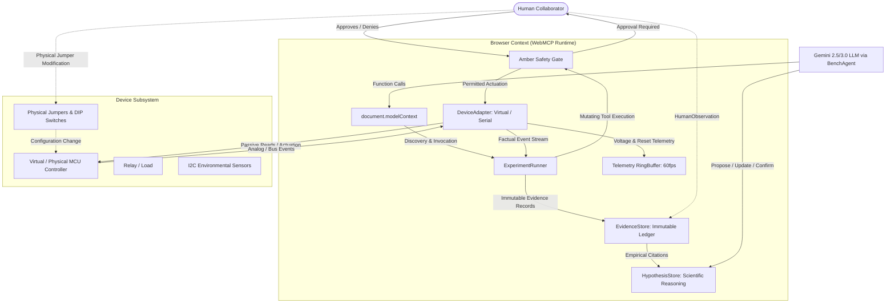

# OHMNI — Browser-Native AI Hardware Investigation Lab

> **Ohmni is a blind hardware investigation lab powered by WebMCP. A fault is hidden inside a virtual/physical device. Gemini does not know the fault. WebMCP gives it live browser-owned diagnostic instruments. Gemini investigates, asks the human for physical help when needed, and experimentally verifies the repair.**

---

## One-Sentence Judge Summary

"Ohmni uses WebMCP to let an AI agent operate live hardware instruments inside the browser, collaborate with a human on physical changes, and experimentally verify a root cause."

---

## The Premise: Why WebMCP?

AI coding agents can inspect software repositories, debug logic, and run linters. But they normally **cannot safely inspect, actuate, measure, and verify the physical device sitting on the user's desk**.

A remote Model Context Protocol (MCP) server can reach your cloud database. **WebMCP can reach the board on your desk.**

WebMCP exposes safe, stateful, browser-owned diagnostic instruments directly to an AI agent through the browser's native `document.modelContext` API. The browser owns the device connection (Web Serial / Virtual Device Adapter), the safety boundaries, and the human consent gates.

---

## Technical Architecture



---

## The Core Investigation Lifecycle

```
[ WELCOME ]
     ↓
[ MYSTERY CHALLENGE ] (Scenario ground truth sealed outside model context)
     ↓
[ OBSERVE ] (Gemini autonomously reads device info, reset logs, sensor bus)
     ↓
[ FORM HYPOTHESES ] (Qualitative confidence tiers: UNTESTED → LOW → MEDIUM)
     ↓
[ CONTROLLED EXPERIMENT ] (Amber Safety Gate: Human authorization required)
     ↓
[ COLLECT EMPIRICAL EVIDENCE ] (Factual Evidence Ledger: E-001, E-002...)
     ↓
[ REQUEST HUMAN INTERVENTION ] ("I need your hands to relocate JP1 to 5V")
     ↓
[ HUMAN PHYSICAL ACTION ] (Technician moves jumper, adds HumanObservation)
     ↓
[ EXPERIMENTAL VERIFICATION ] (Gemini reruns identical test on modified system)
     ↓
[ VERIFIED CONCLUSION ] (Empirically verified: no resets, nominal voltage)
     ↓
[ GROUND TRUTH REVEAL ] (Unseal scenario ground truth → Deterministic Semantic Match)
```

---

## Three Canonical Mystery Scenarios

Ohmni ships with 3 scientifically rigorous hardware fault scenarios. Neither the user nor Gemini is told which scenario is active.

### Scenario A: Relay Supply Brownout
- **Public Symptom:** "The controller unexpectedly restarts when the cooling fan turns on."
- **Hidden Ground Truth:** The relay coil is powered from the shared 3.3V microcontroller rail. Actuating the relay draws high inrush current, causing the 3.3V rail to collapse to 2.72V, triggering an ESP32-S3 hardware `BROWNOUT` reset.
- **Physical Intervention:** Relocate jumper `JP1` from shared 3.3V to external 5V auxiliary rail.
- **Verification:** Rerun relay stress test. Minimum rail voltage remains stable at 3.18V with zero resets.

### Scenario B: I²C Address Mismatch
- **Public Symptom:** "The environmental sensor stopped responding and telemetry reports NACK."
- **Hidden Ground Truth:** The physical sensor hardware responds at address `0x77`, but the controller firmware register targets `0x76`.
- **Physical Intervention:** Toggle DIP address selector from `0x77` to `0x76`.
- **Verification:** Rerun I²C bus probe. Sensor acknowledges at target address and returns valid telemetry.

### Scenario C: Physical SDA Continuity Fault
- **Public Symptom:** "The sensor intermittently disappears from the bus."
- **Hidden Ground Truth:** SDA line is floating / open contact due to an unseated breadboard jumper.
- **Physical Intervention:** Reseat the physical/virtual SDA jumper wire.
- **Verification:** Rerun bus scan. Bus lines idle HIGH (3.3V) and sensor ACK is restored.

---

## WebMCP Instrument Mesh (19 Native Diagnostic Tools)

1. `read_device_info` — Read hardware architecture, firmware version, and target peripherals.
2. `read_reset_history` — Inspect non-volatile reset logs (`BROWNOUT`, `WATCHDOG`, `SOFTWARE_PANIC`).
3. `read_system_health` — Query operational status, clock frequency, and memory headroom.
4. `measure_supply_voltage` — Sample real-time rail voltage with statistical min/max/average.
5. `run_relay_stress_test` — **[AMBER PHYSICAL GATE]** Actuate fan relay under load to test supply stability.
6. `scan_i2c_bus` — Probe 7-bit addresses on physical bus for ACK responses.
7. `read_sensor_status` — Read target address and transaction status registers.
8. `read_i2c_line_state` — Measure electrical continuity and logic states on SCL/SDA lines.
9. `list_evidence` — Query recorded factual evidence records.
10. `get_evidence` — Retrieve full telemetry, provenance, and data for a specific evidence token.
11. `list_hypotheses` — Query proposed diagnostic hypotheses and their confidence tiers.
12. `get_hypothesis` — Read detailed causal explanation, supporting facts, and next proposed tests.
13. `propose_hypothesis` — Formulate a new hypothesis (`UNTESTED`, `LOW`, or `MEDIUM`).
14. `update_hypothesis` — Elevate confidence (`HIGH`) backed by empirical evidence citations.
15. `link_evidence` — Explicitly link evidence tokens (`SUPPORTS` or `CONTRADICTS`).
16. `reject_hypothesis` — Disprove a hypothesis based on conflicting empirical data.
17. `confirm_hypothesis` — Formally mark a hypothesis `CONFIRMED` and `VERIFIED` after post-repair test.
18. `record_conclusion` — Document finalized root cause and technical repair summary.
19. `request_human_intervention` — Formulate physical human instruction with scientific rationale.

---

## Safety Model & Non-Negotiable Invariants

- **Green Instruments (Passive Observation):** Automatic execution. Passive reads cannot damage hardware.
- **Amber Instruments (Physical Actuation):** Pauses execution. Requires explicit human authorization (`[Approve]` / `[Deny]` or keyboard `A`/`D`).
- **Fail-Safe Relay Invariant:** The relay coil is guaranteed to return to `OPEN` across **all exit paths**: normal completion, tool denial, user stop, emergency stop, timeout, unhandled exception, and device disconnection.
- **Hidden-State Firewall:** Gemini prompt, WebMCP tool declarations, system instructions, and schemas are strictly firewalled from scenario ground truth. Ground truth is unsealed only after verified repair.

---

## Running Locally

### Prerequisites
- [Bun](https://bun.sh) (v1.2+)
- Google Chrome (latest stable)

```bash
# Clone the repository
git clone https://github.com/fadyat/ohmni.git
cd ohmni

# Install dependencies
bun install

# Run development server
bun run dev
```

Open `http://localhost:5173` in Google Chrome.

### Running the Full Verification Gate

```bash
# Run the complete release verification suite (all gates stop on first failure)
bun run release:verify
```

This single master command executes:
1. `bun test` — 274 unit & domain tests across 36 files (0 failures).
2. `bun run typecheck` — Strict TypeScript compiler check (`tsc --noEmit`).
3. `bun run build` — Production Vite bundle with vendor chunking.
4. `bun run test:chrome` — Real Google Chrome WebMCP tool discovery & execution.
5. `bun run test:motion` — Real Chrome CDP 60fps motion, LED boot & relay transforms.
6. `bun run test:mystery` — 3/3 blind hardware scenarios + hidden-state firewall audit.
7. `bun run test:chaos` — All 14 failure modes (429, 500, timeouts, disconnects, step limits).
8. `bun run test:visual` — All 13 canonical product scenes & responsive layout checks.

---

## Enabling Native WebMCP in Google Chrome

To test native `document.modelContext` without compatibility mode:
1. Launch Google Chrome with WebMCP feature flag:
   ```bash
   /Applications/Google\ Chrome.app/Contents/MacOS/Google\ Chrome --enable-features=WebMCPTesting
   ```
2. Inspect `window.__webmcpMode` in DevTools: returns `"native"`.
3. The runtime badge in the header shows: `NATIVE WEBMCP`.

---

## Production Deployment

- **Hosting Platform:** Vercel (Edge-ready Vite SPA + serverless `/api/bench-agent` endpoint).
- **Canonical Production URL:** `https://ohmni-three.vercel.app`
- **Deployment Verification:**
  ```bash
  bun run smoke -- https://ohmni-three.vercel.app
  ```

---

## Known Limitations

1. **Hardware Web Serial Support:** Experimental prototype. Web Serial adapter is designed for real ESP32-S3 boards running Ohmni NDJSON firmware, but the virtual simulator is the canonical judge-ready demo.
2. **Gemini API Key:** Resides exclusively on the secure serverless edge in Vercel (`GEMINI_API_KEY`). Local developer test runs use the high-fidelity deterministic provider to protect test reproducibility.
